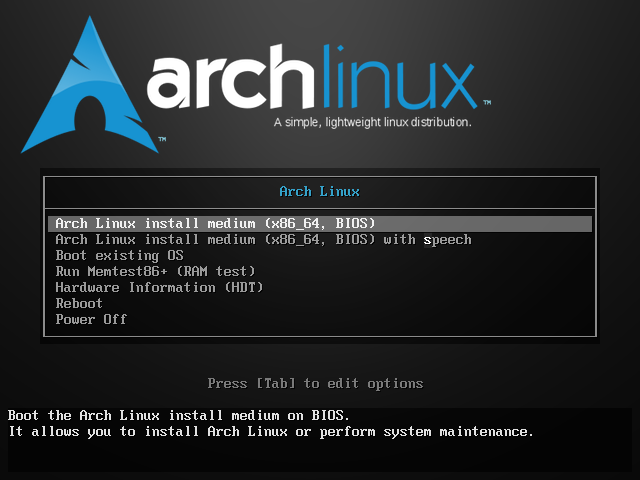

Arch Linux est une distribution GNU/Linux légère et flexible conçue selon la philosophie Keep It Simple, Stupid (KISS). Elle repose sur un modèle de mise à jour continue (rolling release), ce qui signifie que les utilisateurs disposent en permanence des dernières versions des logiciels sans avoir à réinstaller le système.
La distribution utilise le format de paquet .pkg.tar.zst, géré par le gestionnaire de paquets pacman, reconnu pour sa rapidité et sa simplicité.
Arch Linux est entièrement libre et open source, destinée avant tout aux utilisateurs avancés souhaitant un contrôle total sur leur système. Elle ne possède pas de nom de code : son dépôt principal est continuellement mis à jour. La communauté active entretient également le AUR (Arch User Repository), un vaste dépôt de paquets maintenus par les utilisateurs, qui permet d’accéder à un écosystème logiciel extrêmement riche.



## Paramètrage du clavier

Une fois que l’ISO est boot, nous allons charger la disposition de clavier en français dans notre console pour l’installation d’ArchLinux.
C’est temporaire, elle ne s’appliquera qu’à la session en cours.

```
loadkeys fr
```

## Paramétrage de SSH

```
passwd root
```

```
root@archiso ~ # passwd root  
New password:  
Retype new password:  
passwd: password updated successfully  
```

On configure SSH Serveur en éditant le fichier /etc/ssh/sshd_config à l'aide de nano ou de vim. On chercher "PermitRootLogin" sur lequel on vient enlever le commentaire # pour appliquer la directive et on mets la valeur à "yes".

```
PermitRootLogin yes
```

A part de maintenant, nous pouvons nous connecter grâce à un client SSH sur notre machine virtuelle. Je vous recommande vivement « Windows Terminal » comment client SSH si vous êtes sur Windows. Dans la commande ci-dessous on peut voir que l’adresse IP de ma machine virtuelle est « 192.168.68.130 ».

```
ssh root@192.168.68.130
```

```
ip a
```

```
root@archiso ~ # ip a
1: lo: <LOOPBACK,UP,LOWER_UP> mtu 65536 qdisc noqueue state UNKNOWN group default qlen 1000
    link/loopback 00:00:00:00:00:00 brd 00:00:00:00:00:00
    inet 127.0.0.1/8 scope host lo
       valid_lft forever preferred_lft forever
    inet6 ::1/128 scope host noprefixroute
       valid_lft forever preferred_lft forever
2: ens33: <BROADCAST,MULTICAST,UP,LOWER_UP> mtu 1500 qdisc fq_codel state UP group default qlen 1000
    link/ether 00:0c:29:0c:fd:db brd ff:ff:ff:ff:ff:ff
    altname enp2s1
    altname enx000c290cfddb
    inet 192.168.68.130/24 metric 100 brd 192.168.68.255 scope global dynamic ens33
       valid_lft 1346sec preferred_lft 1346sec
    inet6 fe80::20c:29ff:fe0c:fddb/64 scope link proto kernel_ll
       valid_lft forever preferred_lft forever
```

On peut donc se connecter en SSH grâce à cette commande depuis Windows Terminal, ou tout autre client SSH :

```
ssh root@192.168.68.130
```

On va pouvoir commencer correctement ! Je reprécise que tout ce que l’on a fait jusqu’à maintenant est temporaire jusqu’au reboot de la machine 😁

---

## Partitionnement

```
fdisk -l
```

```
fdisk /dev/sda
```

```
Command (m for help): n
```

```
Select (default p): p
```

```
Partition number (1-4, default 1): 1
```

```
First sector (2048-104857599, default 2048): 2048
```

```
Last sector, +/-sectors or +/-size{K,M,G,T,P} (2048-104857599, default 104857599): +30G
```

```
Command (m for help): n
```

```
Select (default p): p
```

```
Partition number (2-4, default 2): 2
```

```
First sector (62916608-104857599, default 62916608): 62916608
```

```
Last sector, +/-sectors or +/-size{K,M,G,T,P} (62916608-104857599, default 104857599): +18G
```

Et maintenant on passe à la partition SWAP


```
Command (m for help): n
```

```
Select (default p): p
```

```
Partition number (3,4, default 3): 3
```

```
First sector (100665344-104857599, default 100665344): 100665344
```

```
Last sector, +/-sectors or +/-size{K,M,G,T,P} (100665344-104857599, default 104857599): 104857599
```

On va prendre notre troisième partition, celle de SWAP pour lui changer son type et indiquer que ça va être du SWAP.

```
Command (m for help): t
```

```
Partition number (1-4): 3
```

```
Hex code (type L to list all): 82
```

```
Command (m for help): p
```

```
Disk /dev/sda: 50 GiB, 53687091200 bytes, 104857600 sectors
Disk model: VMware Virtual S
Units: sectors of 1 * 512 = 512 bytes
Sector size (logical/physical): 512 bytes / 512 bytes
I/O size (minimum/optimal): 512 bytes / 512 bytes
Disklabel type: dos
Disk identifier: 0xda427e83

Device     Boot     Start       End  Sectors Size Id Type
/dev/sda1            2048  62916607 62914560  30G 83 Linux
/dev/sda2        62916608 100665343 37748736  18G 83 Linux
/dev/sda3       100665344 104857599  4192256   2G 82 Linux swap / Solaris

```


```
Command (m for help): w
```

```bash
mkfs.ext4 /dev/sda1
```

```bash
mkfs.ext4 /dev/sda2
```

```bash
mkswap /dev/sda3
```

On monte nos systèmes de fichiers

```bash
mount /dev/sda1 /mnt
```

```bash
mkdir /mnt/home
```

```bash
mount /dev/sda2 /mnt/home
```

```bash
swapon /dev/sda3
```

```bash
pacstrap -i /mnt base linux linux-firmware sudo vim
```

```bash
genfstab -U -p /mnt > /mnt/etc/fstab
```

```bash
arch-chroot /mnt
```

```bash
vim /etc/locale.gen
```

```bash
locale-gen
```

```bash
echo "LANG=fr_FR.UTF-8" > /etc/locale.gen
```

```bash
ln -sf /usr/share/zoneinfo/Europe/Paris /etc/localtime
```

```bash
hwclock --systohc
```

```bash
echo archserver > /etc/hostname
```

```bash
vim /etc/hosts
```

```bash
useradd -m -G wheel,storage,power,audio,video -s /bin/bash flynn
```

```bash
passwd flynn
```

On peut éditer notre fichier sudoers avec la commande « visudo » qui est un outil spécialement conçu pour éditer en toute sécurité le fichier « /etc/sudoers », afin d’éviter de se couper la main en bloquant l’accès au système. On cherche « %wheel ALL=(ALL) ALL » sur lequel on vient enlever le commentaire # pour appliquer la directive et donner les droits sudo à tous les membres du groupe wheel.

```bash
visudo
```

```bash
%wheel ALL=(ALL) ALL
```

La commande grub-install permet d’installer le chargeur d’amorçage GRUB (GRand Unified Bootloader). On vient l’installer de façon général sur le disque principal.

```bash
grub-install /dev/sda
```

```bash
grub-mkconfig -o /boot/grub/grub.cfg
```

```bash
pacman -S openssh
```

```bash
systemctl start sshd
```

```bash
systemctl enable sshd
```

```bash
pacman -S dhcpcd networkmanager resolvconf
systemctl enable dhcpcd
systemctl enable NetworkManager
systemctl enable systemd-resolved
```
