**Debian** est la distribution Linux de base ayant introduit le format de paquet **.deb**. Elle est disponible sous le nom de code **Trixie (Debian13)** pour la dernière version stable, idéal pour des serveurs. Elle est utilisée comme base pour de nombreuses autres distributions Linux, comme Ubuntu. Les ordinateurs personnels préféreront utiliser d'autres version comme **Forky (Debian14)** qui possède des logiciels plus récents, ou encore **Sid** qui est la version de développement continue.

## Préparer le support

L'image netinst suffit dans la quasi-totalité des cas : elle pèse moins de
400 Mo et récupère le reste depuis les dépôts, ce qui garantit des paquets à
jour dès la fin de l'installation.

```bash
# Vérifier l'empreinte avant d'écrire quoi que ce soit
sha256sum -c SHA256SUMS --ignore-missing

# Écriture sur la clé — vérifier deux fois le nom du périphérique
sudo dd if=debian-13.0.0-amd64-netinst.iso of=/dev/sdX bs=4M status=progress
sudo sync
```

La vérification d'empreinte n'est pas une formalité. Une image tronquée
produit une erreur au milieu de l'installation, souvent après le
partitionnement, c'est-à-dire au pire moment.

> Ne jamais présumer du nom du périphérique. `lsblk` avant, `lsblk` après :
> la différence, c'est votre clé.

## Démarrage de l'installation

Lors du démarrage de l’installateur de Debian, nous arrivons sur ce menu qui comporte plusieurs options. Je choisis « Graphical install » qui est plus convivial que « Install » représentant le mode texte. Ce choix concerne uniquement l’interface de l’installateur et n’a aucune incidence sur la finalité de l’installation.

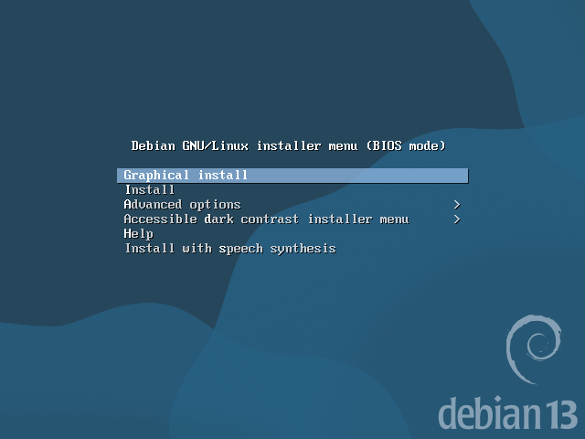

Suite au choix « Graphical install », l’interface graphique nous invite à sélectionner la langue que l’on va utiliser pour le processus d’installation de la machine. La liste propose une grande variété de langues, comme la barre de surbrillance bleue nous indique, nous allons choisir « French – Français » qui est notre language préféré.

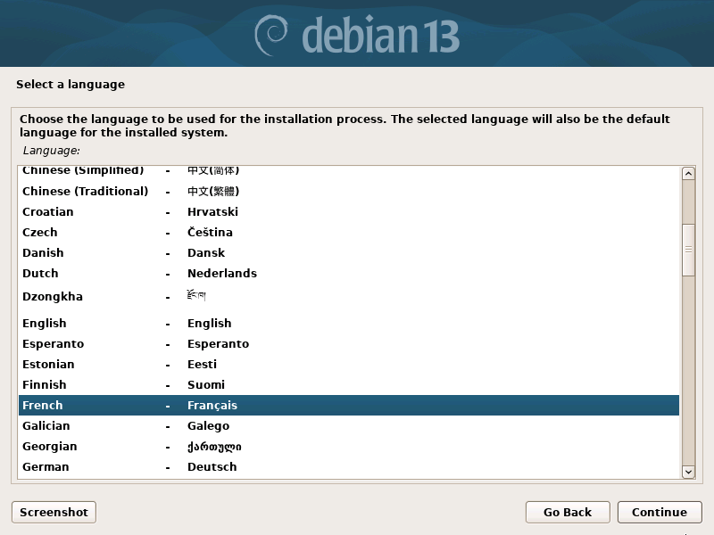

Dans cette étape qui nous est présenté avec le choix précédent, des propositions sont apparus afin de permettre la configuration de votre fuseau horaire grâces aux locales.

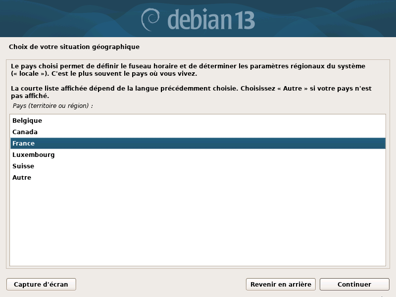

L’installation de Debian nous présente maintenant l’étape de configuration du clavier. On choisit le clavier qui présente au mieux notre clavier afin d’éviter des désagréments. J’utilise personnellement un clavier azerty, je choisis donc Français.

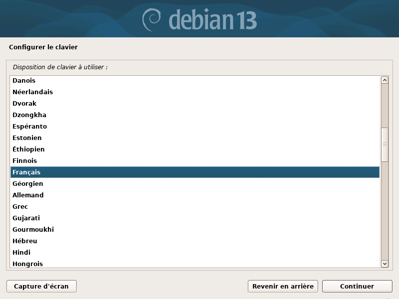

Il faut maintenant renseigner le nom du système pour notre machine, il permettra une identification sur le réseau. En tant que particulier, vous pouvez mettre ce que vous voulez. Les entreprises d’aujourd’hui utilisent dans la plupart des cas une convention de nommage, représentant un département, l’année d’achat de la machine, un numéro ou encore la localisation de la machine par exemple.

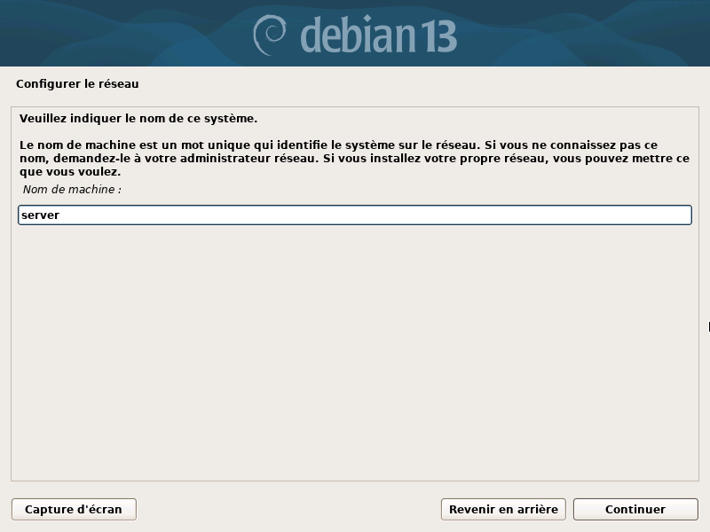

L’installateur nous demande le nom de domaine, nous ne sommes pas dans l’obligation de le renseigner cela ne devra pas nous impacter. Pour les entreprises, le DHCP devrait le fournir automatiquement. Il va permettre de résoudre les noms DNS sur notre réseau.

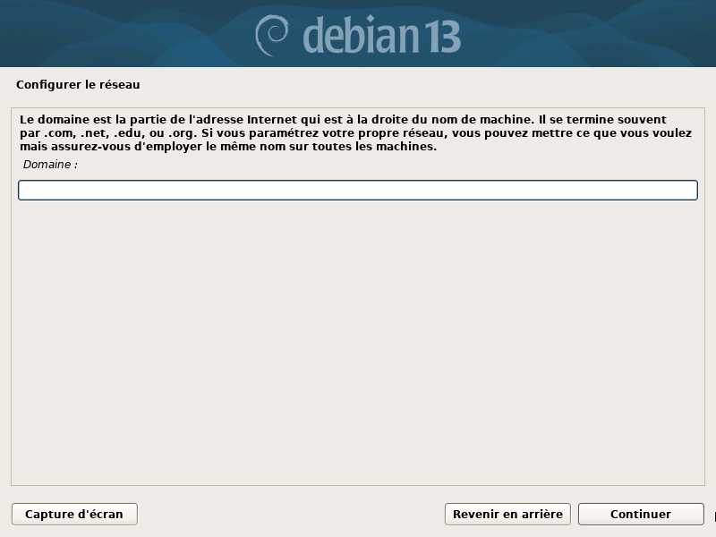

Le mot de passe « root » vous est demandé, il est comme un compte utilisateur normal, mais possède tous les droits d’administration, ou peut se les attribuer. Il est par défaut disponible sur toutes les distributions. En ne renseignant pas le mot de passe root, cela désactive ce compte. Dans ce cas l’utilisateur peut s’attribuer les droits d’administration grâce à la commande sudo. Pour toutes machines hormis du test en local sur les postes locaux, le mot de passe se doit d’être robuste.

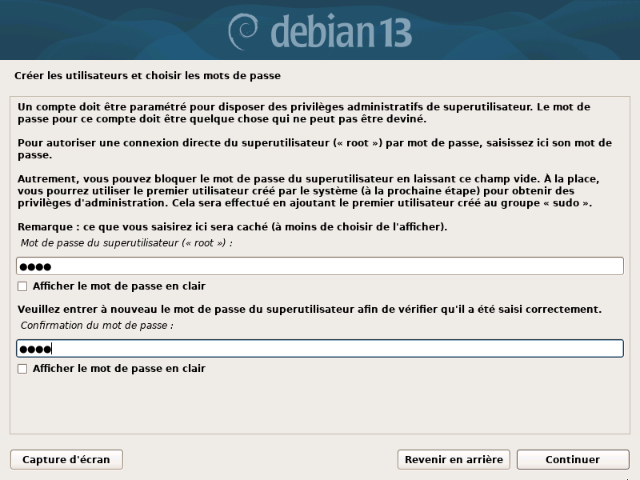

On renseigne le nom de l’utilisateur qui s’affichera au gestionnaire de connexion. Ce même nom est utile pour pouvoir pré-remplir des champs tels que sur les logiciels de messagerie.

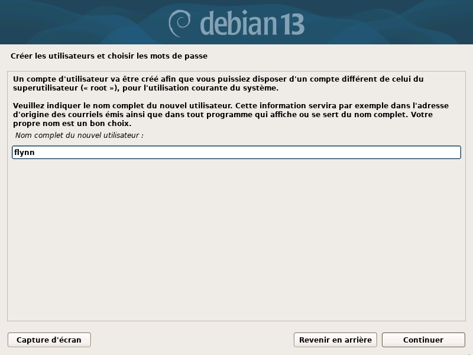

L’identifiant de la création du compte utilisateur joue un rôle important, il va nous permettre la connexion à la machine et doit être unique sur le système.

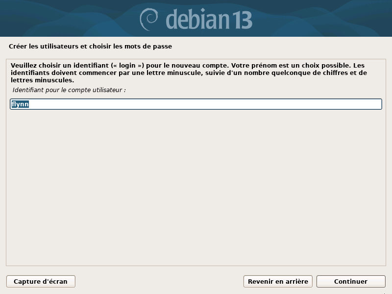

Le mot de passe pour la création de ce compte utilisateur est en lien avec l’identifiant, ils sont liés pour la connexion. Pour toutes machines hormis du test en local sur les postes locaux, le mot de passe se doit d’être robuste.

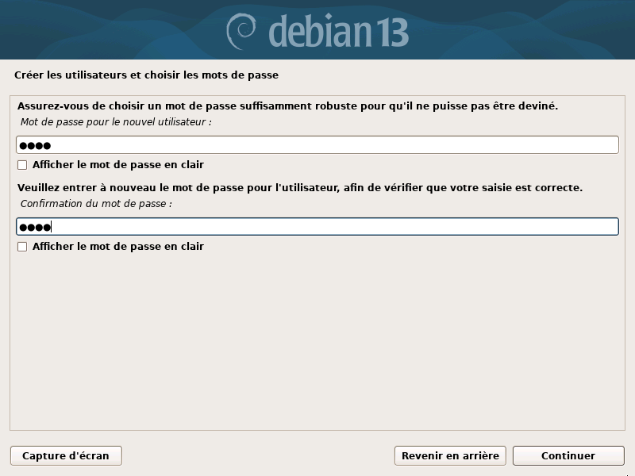

Sur cet écran, le programme d’installation propose différentes méthodes de partitionnement. La première option « Assisté – utiliser un disque entier » est parfaite pour ceux qui préfèrent une approche simplifiée et qui souhaitent dédier l’intégralité de leur disque à Debian. La seconde option « Assisté – utiliser tout un disque avec LVM » est pour les utilisateurs souhaitant bénéficier des avantages du gestionnaire de volumes logiques (LVM), ce qui offre plus de flexibilité pour gérer l’espace disque après l’installation. La troisième option « Assisté – utiliser tout un disque avec LVM chiffré » ajoute une couche supplémentaire de sécurité avec le chiffrement du disque entier. Enfin, pour les utilisateurs avancés, l’option « Manuel » offre le contrôle total sur le partitionnement. Dans notre cas nous allons utiliser l’option qui est en surbrillance « Assisté – utiliser tout un disque avec LVM ».

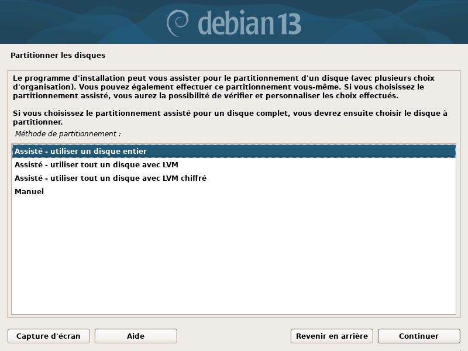

L’installateur nous demande maintenant quelle disque nous souhaitons partitionner afin de pouvoir installer le système d’exploitation. Dans notre cas nous possédons qu’un seul disque, on prend donc le choix par défault.

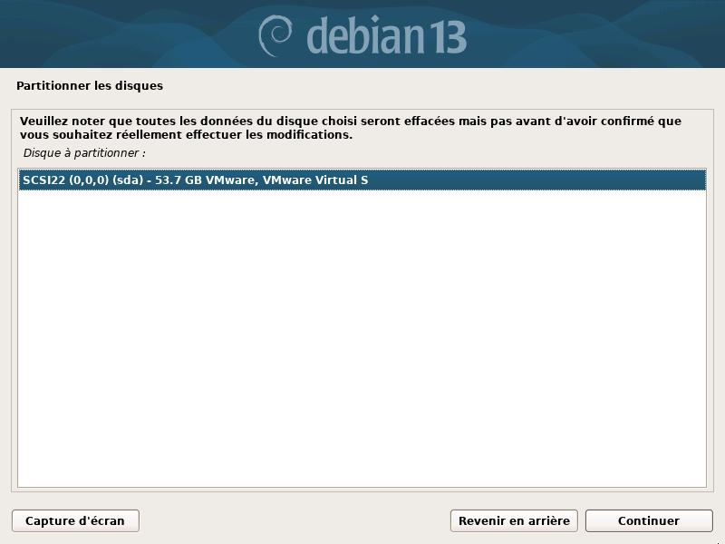

Pour des machines de tests, nous restons sur un partitionnement de base. On sélectionne le choix en surbrillance « Tout dans une seule partition (recommandé pour les débutants) »

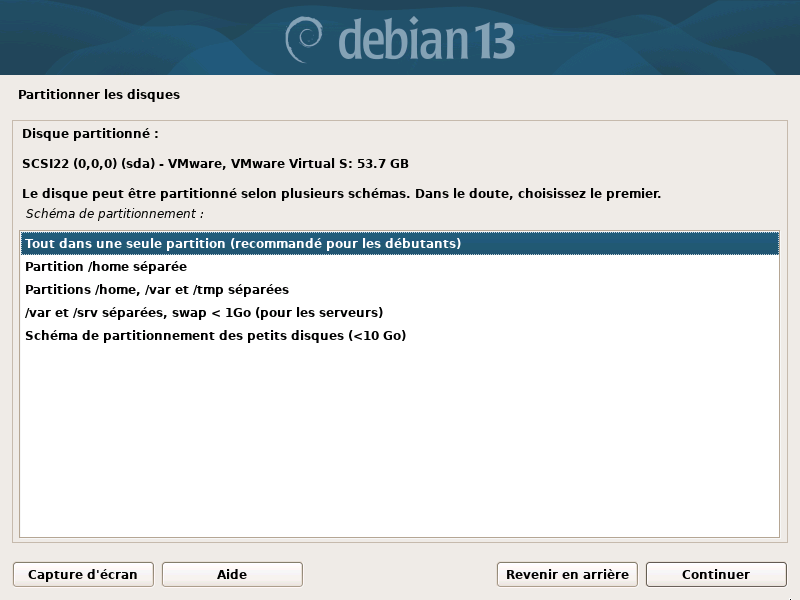

On accepte le schéma de partition que l'installateur nous propose en sélectionnant « Terminer le partitionnement et appliquer les changements ».

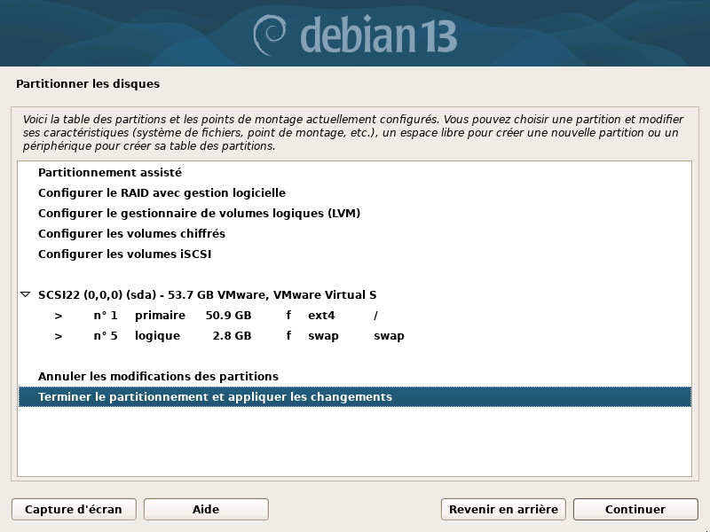

On accepte le schéma de partition que nous propose l’installateur en sélectionnant « oui ».

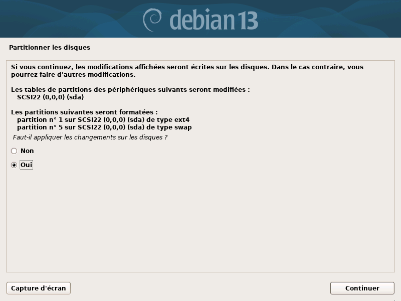

On ne souhaite pas analyser d’autres supports d’installation. Cette étape permettait de pouvoir mettre l’installateur sur plusieurs supports avant de pouvoir faire l’installation lorsque nous n’avions pas beaucoup d’espace.

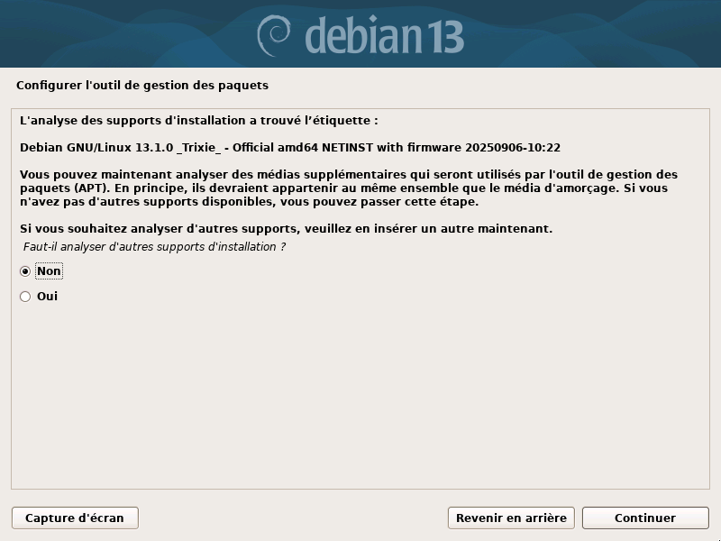

Les systèmes d’exploitations GNU/Linux utilisent des miroirs pour installer des paquets logiciels. Il représente un dépôt qui va contenir une liste des logiciels installables. Nous choisissons France, un miroir de notre pays est très souvent l’un des plus rapides que nous pouvons trouver.

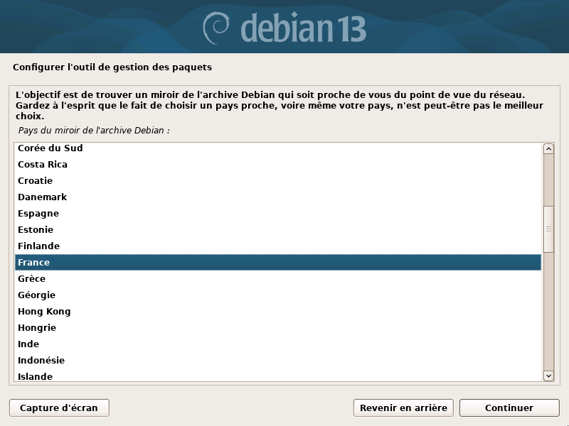

En fonction du pays choisi précédemment, il nous est présentés tous les miroirs disponibles du pays. On choisit un miroir qui est au plus proche de nous ou qui nous semble le plus convaincant.

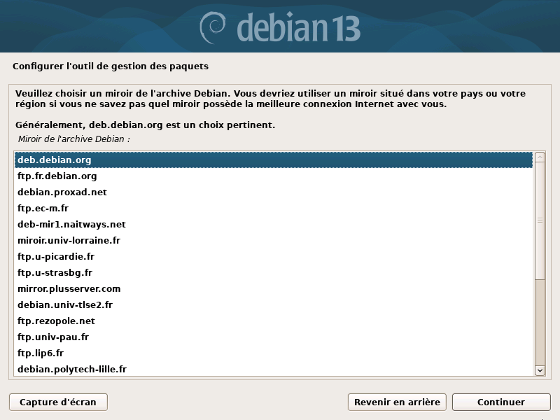

Cette étape nous permet de renseigner un serveur mandataire, ou proxy. Dans la plupart du temps, nos réseaux personnels ne possèdent pas de proxy, nous pouvons donc laisser cette étape vide.

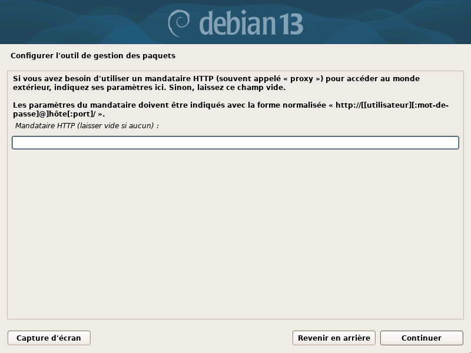

Debian réalise des statistiques anonymement sur les paquets les plus utilisés sur sa distribution, c’est invisible aux yeux de l’utilisateur et permet à ses développeurs de pouvoir rendre la distribution meilleure.

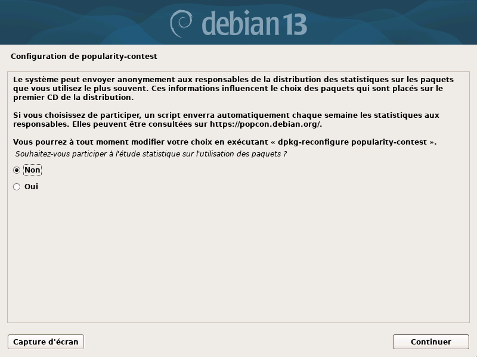

Arrive l’étape des logiciels à installer. Pour un particulier sur une station de travail, vous pouvez choisir un environnement de bureau selon vos préférences. Un seul environnement de bureau est conseillé, pour vous permettre de vous y retrouver. Dans notre cas, pour un serveur, il est conseillé de ne cocher aucun environnement de bureau, mais de laisser « Utilitaires usuels du système » ainsi que « serveur SSH » qui vous permettra de vous connecter à distance. Ne pas cocher d’environnement de bureau permettra à votre serveur d’être plus léger, d’avoir moins de mise à jour à faire et moins de maintenance. Cela vous habituera également à la ligne de commande.

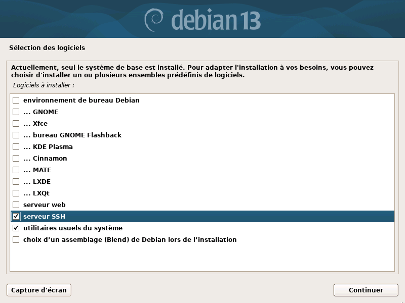

Une fois l’installation les packages téléchargés et installés, il nous ai demandé si nous voulons installer le programme de démarrage GRUB. Dans la plupart des cas, nous sélectionnons oui, il va permettre à notre système de démarrer.

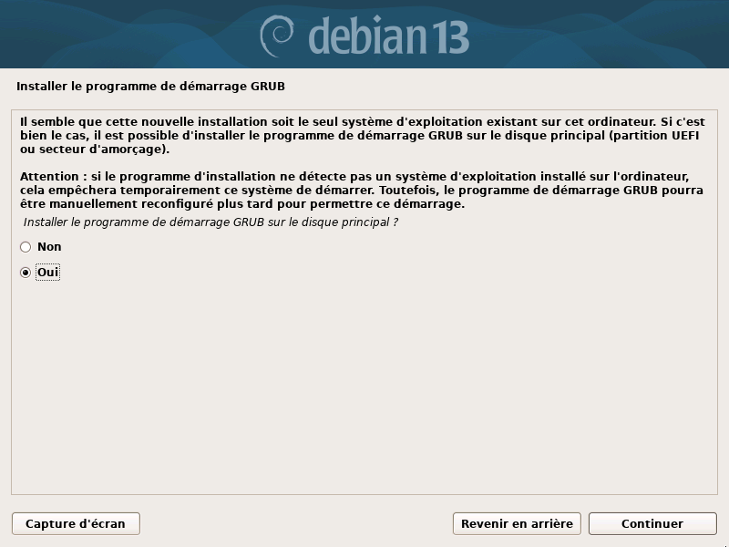

Dans cette étape, l’installateur nous demande ou nous souhaitons installer GRUB. Nous sélectionnons donc le seul disque que nous avons sur notre machine.

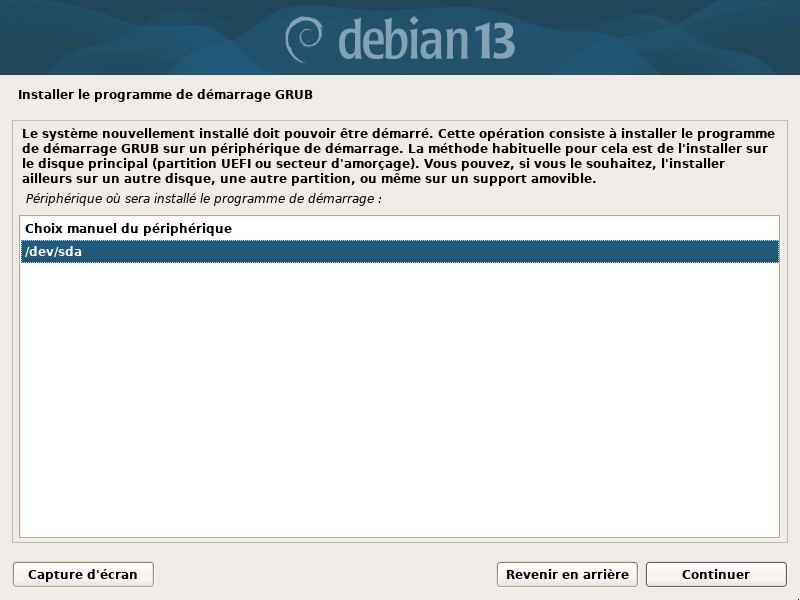

L’installation est maintenant terminée, vous pouvez retirer le support d’installation et profiter pleinement de votre Debian fraichement installée.

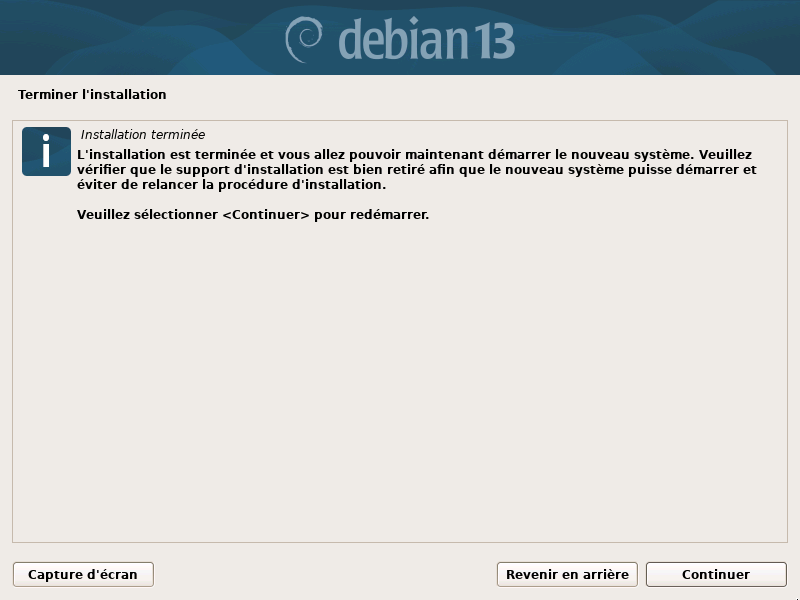

La machine redémarre, on arrive sur le grub qui nous permet de choisir notre système à démarrer. Ici nous n’en avons qu’un seul.

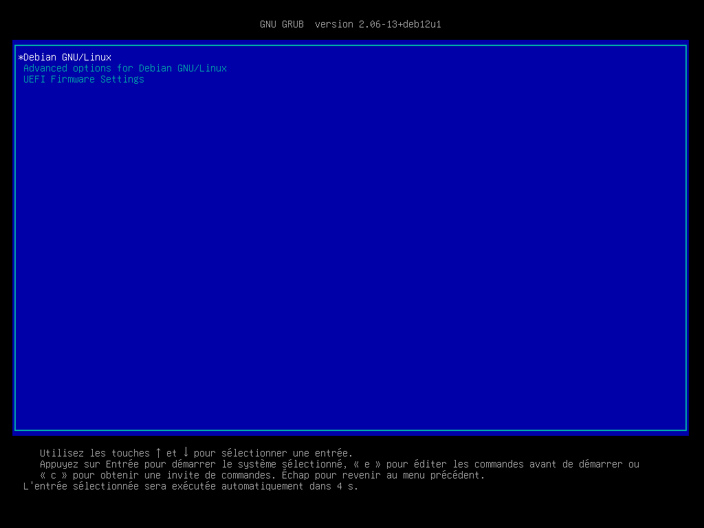

Et une fois que nous avons passer l’étape du grub, nous sommes bien arrivés sur notre système d’exploitation ! 😁

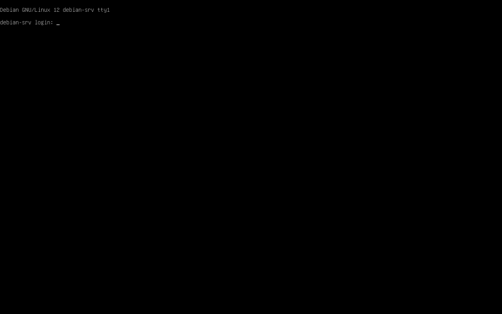


