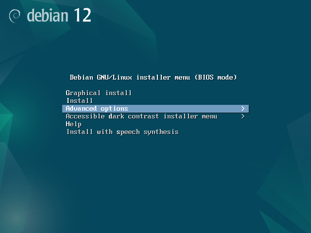
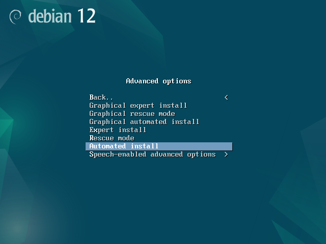
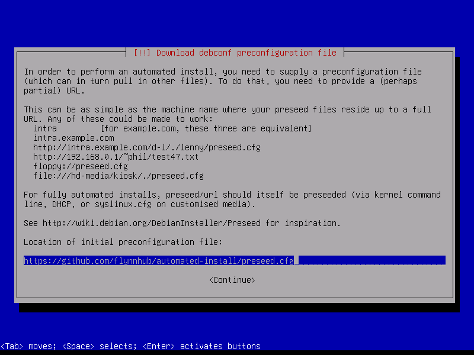

## Cette article va présenter comment installer Debian avec preseed

Afin de pouvoir automatiser l’installation de Debian et de ses dérivés, nous pouvons écrire des fichiers de réponse qui permettent de dérouler une installation sans interaction utilisateur. Ce fichier est prénommé preseed pour Debian, ou encore Kickstart pour RedHat et ses dérivés. Il existe plusieurs façon de spécifier ce fameux fichier de réponse, soit en modifiant directement le fichier ISO, soit en le spécifiant dans le lancement de l’installation.

## Preseed.cfg

```
d-i debian-installer/locale string fr_FR
d-i console-keymaps-at/keymap select fr
d-i keyboard-configuration/xkb-keymap select fr(latin9)
d-i netcfg/choose_interface select auto
d-i netcfg/get_hostname string DEB-SRV
d-i netcfg/get_domain string overcomputing.net
d-i mirror/country string manual
d-i mirror/http/hostname string http.us.debian.org
d-i mirror/http/directory string /debian
d-i mirror/http/proxy string
d-i mirror/suite string stable
d-i clock-setup/utc boolean true
d-i time/zone string Europe/Paris
d-i clock-setup/ntp boolean false
d-i partman-auto/method string regular
d-i partman-auto/choose_recipe select atomic
d-i partman/confirm_write_new_label boolean true
d-i partman/choose_partition select finish
d-i partman/confirm boolean true
d-i partman/confirm_nooverwrite boolean true
d-i passwd/root-password password root
d-i passwd/root-password-again password root
d-i passwd/make-user boolean false
d-i apt-setup/non-free boolean true
d-i apt-setup/contrib boolean true
d-i apt-setup/cdrom/set-first boolean false
d-i apt-setup/cdrom/set-next boolean false   
d-i apt-setup/cdrom/set-failed boolean false
popularity-contest popularity-contest/participate boolean false
tasksel tasksel/first multiselect standard
d-i pkgsel/include string openssh-server build-essential
d-i grub-installer/only_debian boolean true
d-i grub-installer/bootdev string /dev/sda
d-i debian-installer/exit/poweroff boolean true
d-i finish-install/reboot_in_progress note

d-i preseed/late_command string cp /cdrom/post_install.sh /target/root/; chmod +x /target/root/post_install.sh; in-target /bin/bash /root/post_install.sh
```

### Méthode 1: Indication du fichier preseed lors de l’installation

Dans un premier temps, nous allons faire la première méthode. Une fois notre fichier preseed.cfg configuré et héberger de façon à être disponible, nous pouvons dès lors lancer l’ISO officiel de Debian. Sur cette prémière interface, nous allons accéder à « Advanced options » comme indiqué en surbrillance.



Une fois l’option « Advanced options » sélectionné, un nouveau menu est apparu, et nous pouvons maintenant sélectionner « Automated install ».



Le système va commencer à effectuer quelques actions de base, comme recevoir une configuration DHCP afin de pouvoir accédera au réseau par exemple. Par la suite, il va demander notre fichier preseed, on indique donc l’adresse de notre fichier.



### Méthode 2: Intégration du fichier preseed dans l’ISO

Cette seconde méthode permet de déployer une installation de Debian sans même à avoir besoin de spécifier l’emplacement du fichier preseed. Elle va donc nous permettre de nous affranchir d’une étape manuelle supplémentaire.

```
apt install wget genisoimage
```

```
wget https://cdimage.debian.org/debian-cd/current/amd64/iso-cd/debian-13.4.0-amd64-netinst.iso
```

```bash
7zz x -odebian-ps debian-13.4.0-amd64-netinst.iso
```

```bash
cd debian-ps
```

On créé notre fichier preseed.cfg dans le dossier extrait de Debian, le fichier doit être neutre, sans commentaire afin d’éviter tout problème de corruption.

On vient mettre notre fichier [preseed.cfg](#preseedcfg) vu précédemment dans la partie dédié au fichier.

```bash
vim preseed.cfg
```

Dans la dernière commande de notre fichier preseed.cfg, j’exécute un script « post_install » qui va permettre de rendre notre machine virtuelle de développement plus utilisable dès la première utilisation. Il exécute un fichier post_install.sh, dans mon cas sur mes machines de développement mon fichier post_install.sh ressemble à ceci :

```bash
vim post_install.cfg
```

```bash
#!/bin/bash
export DEBIAN_FRONTEND=noninteractive
export NEEDRESTART_MODE=a

# Disable CDrom sources to avoid problems installations
sed -i 's/^deb cdrom:/#deb cdrom:/' /etc/apt/sources.list

# Install somes packages
apt-get update -y
apt-get install git vim wget curl net-tools -y

# Disable bell in terminal
echo "set bell-style none" >> /etc/inputrc

# Disable bell in vim
echo "set belloff=all" >> /etc/vim/vimrc

# Configure SSH to allow root login
echo "PermitRootLogin yes" >> /etc/ssh/sshd_config

# Configure Issue to show IP
echo "Debian GNU/Linux 13 | My IP address : \4" > /etc/issue

# Configure some Alias for root user and users
echo "alias ll='ls -l --color=auto'" >> /root/.bashrc

# Add ssh keys
mkdir -p /root/.ssh
chmod 700 /root/.ssh
echo "ssh-ed25519 AAAAC3NzaC1lZDI1NTE5AAAAIDLhPllgh2X+0qWFOa5SStr4efGK4qgVG5vZyVehWhau flynn@zeorus" >> /root/.ssh/authorized_keys
chmod 600 /root/.ssh/authorized_keys

# Modification du grub à 1s
sed -i 's/^GRUB_TIMEOUT=.*/GRUB_TIMEOUT=1/' /etc/default/grub
update-grub
```

Nous allons maintenant rendre modifiable notre fichier fichier initrd, le décompresser et y ajouter notre fichier preseed.cfg. Chaque commande est à exécuter les unes à la suite des autres.

```bash
chmod +w -R install.amd/

gunzip install.amd/initrd.gz

echo preseed.cfg | cpio -H newc -o -A -F install.amd/initrd

gzip install.amd/initrd

chmod -w -R install.amd/
```

Nous allons maintenant régénérer le md5. Chaque commande est à exécuter les unes à la suite des autres.

```bash
chmod +w md5sum.txt

find -follow -type f ! -name md5sum.txt -print0 | xargs -0 md5sum > md5sum.txt

chmod -w md5sum.txt
```

On génère maintenant notre nouvel ISO.

```bash
genisoimage -r -J -b isolinux/isolinux.bin -c isolinux/boot.cat -no-emul-boot -boot-load-size 4 -boot-info-table -o ../debian-13-ps.iso .
```

## Conclusion !

Grâce à notre nouvel ISO précédemment généré, à partir de maintenant quand nous voulons installer notre machine de développement, nous avons la possibilité de soit faire l’installation en « Graphical Install »qui déroulera une installation personnalisé, ou « Install » qui viendra dérouler l’installation sans interaction utilisateur grâce à notre fichier preseed.