RedHat est la distribution GNU/Linux de base ayant introduit le format de paquet .rpm. Elle est disponible sous le nom de code « Shrike » qui offre des paquets stables, idéal pour les serveurs. La distribution est libre et open source mais est soumise à une licence commerciale, qui permet d’accéder à un support. 

---

## Démarrage de l'installation

Lors du démarrage de l’installateur de RedHat, nous arrivons sur ce menu qui comporte plusieurs options. Nous choisissons « Install Red Hat Enterprise Linux 9.1 » 

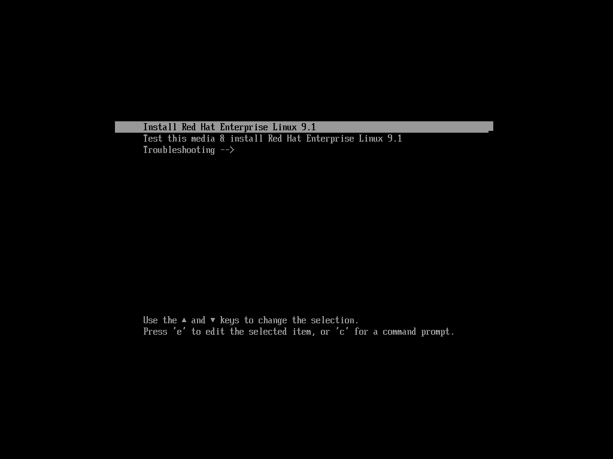

Après un certain temps, l’installer démarre et nous propose le langage dans lequel nous voulons faire l’installation.

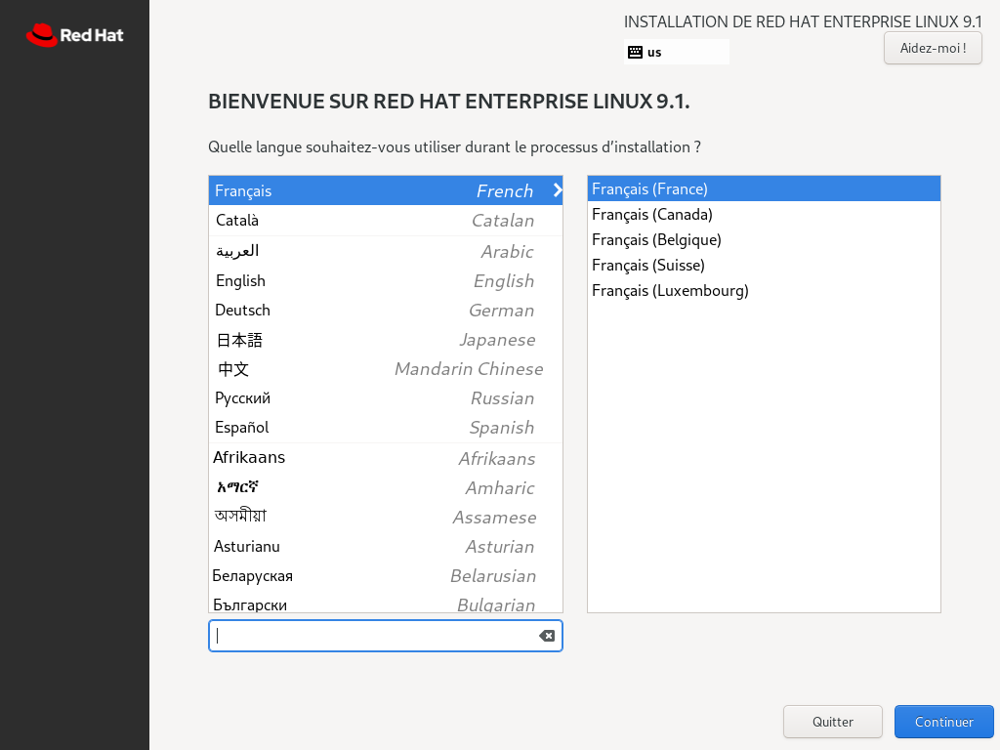

Nous arrivons ensuite sur cette fenêtre avec différents points à compléter. On clique sur « Mot de passe administrateur » afin de pouvoir activer le compte root pour nos tâches d’administrations.

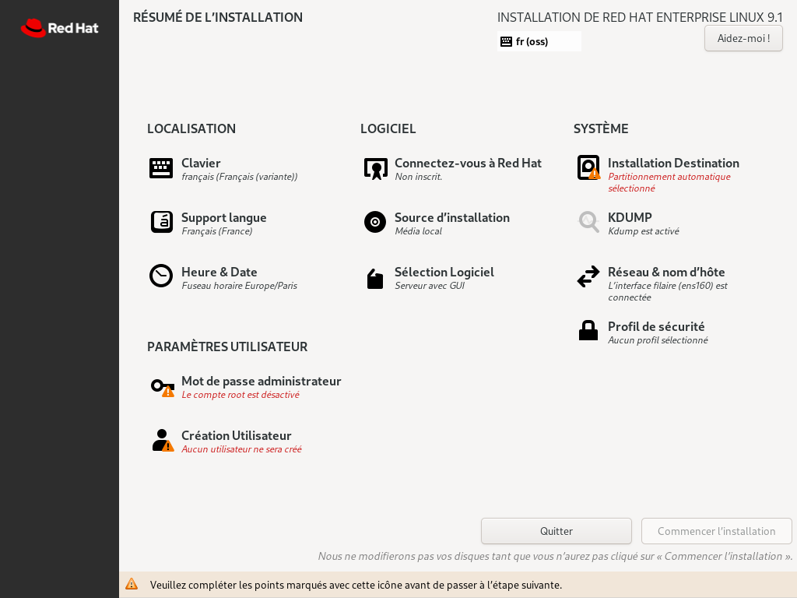

On vient saisir le mot de passe que nous souhaitons lui attribuer, ici « root ». C’est évidemment un mauvais conseil, mais à des fins de machine de tests dans le réseau local non accessible depuis l’extérieur, ça passe 😊. On coche également « Permettre les connexions SSH avec mot de passe », puis sur « Fait ». Si le mot de passe est faible, il faut cliquer deux fois sur « Fait ».

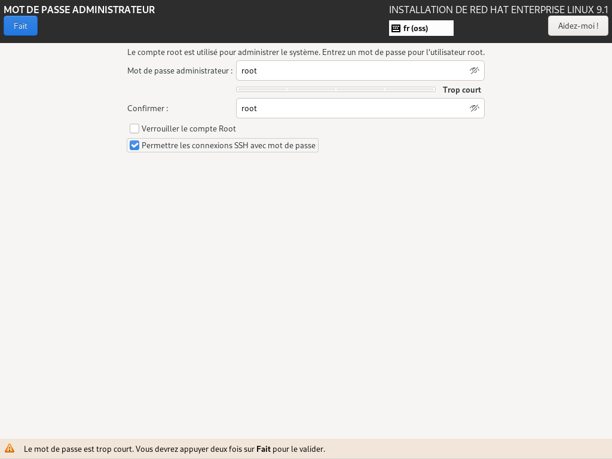

Nous sommes de retour sur cette interface, nous allons maintenant créer un utilisateur. On clique sur « Création Utilisateur ».

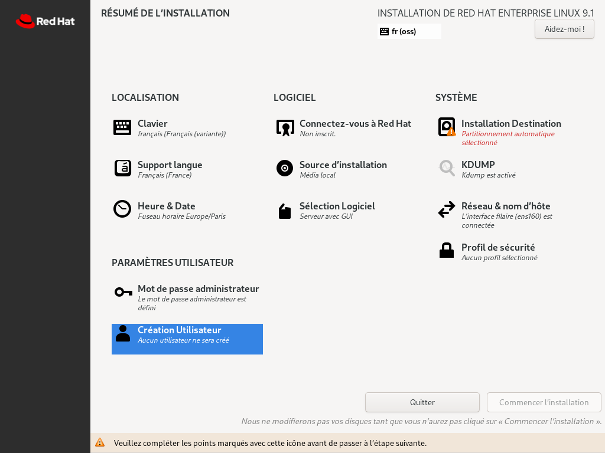

On vient renseigner le « Nom et prénom » qui va permettre de remplir certains champs directement, comme la configuration d’une adresse e-mail par exemple. On vient mettre un nom d’utilisateur, on coche « Exiger un mot de passe pour utiliser ce compte ». Puis un mot de passe associé au compte et on appuie sur « Fait ».

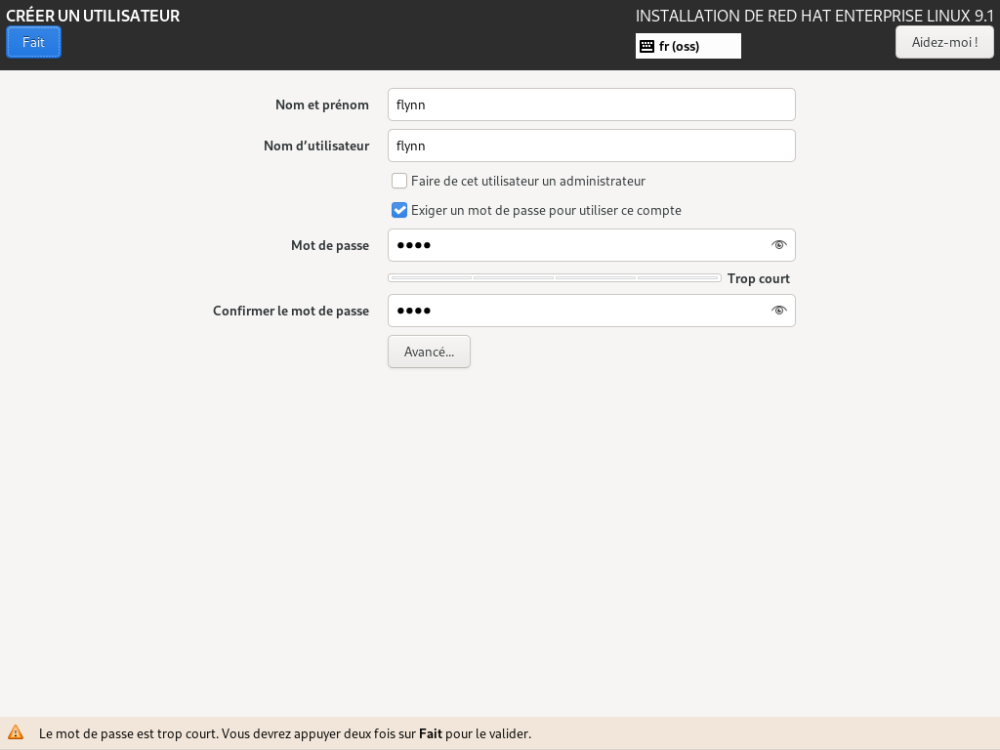

On vient cliquer sur « Sélection Logiciel » afin de changer ce que l’on souhaite installer.

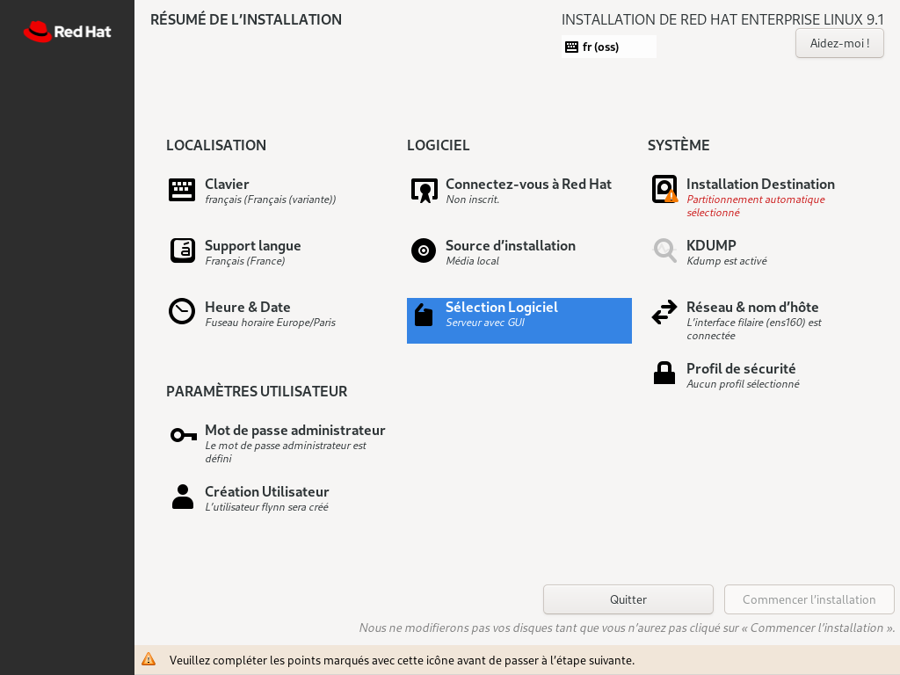

On sélectionne « Installation minimale » puis les sous-catégories « Agents invités » & « Standard ».

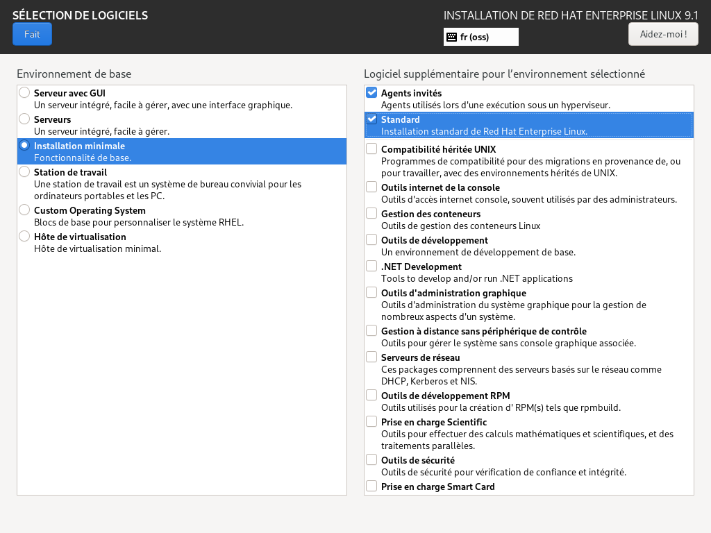

Sur le résumé de l’installation, dans la partie système, on vient sélectionner « Installation Destination ».

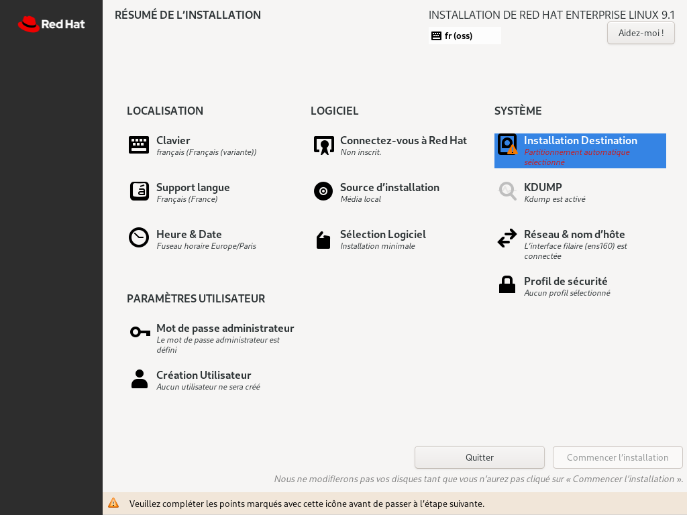

Dans cette interface, nous avons un seul disque qui est automatiquement sélectionner, nous pouvons donc directement cliquer sur « Fait ».

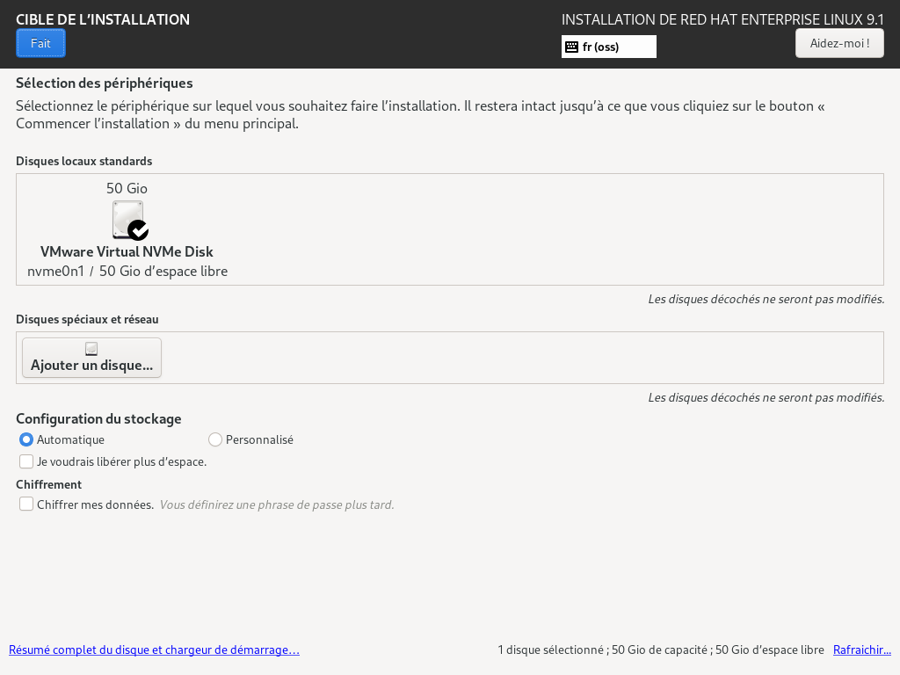

Sur la page du résumé de l’installation, nous voyons maintenant que le logo « Commencer l’installation » est maintenant dégrisé, on clique donc dessus.

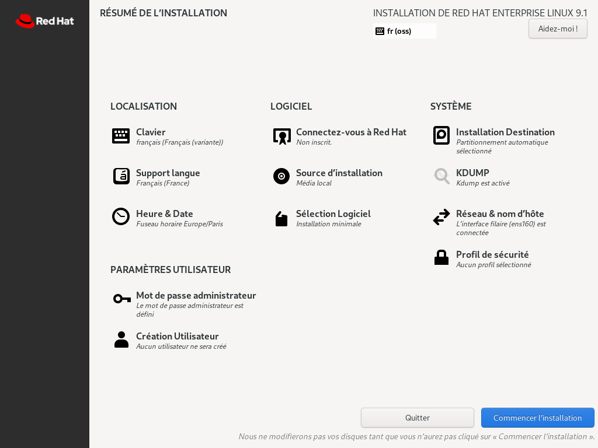

Nous avons plus qu’à attendre que l’installation se fasse.

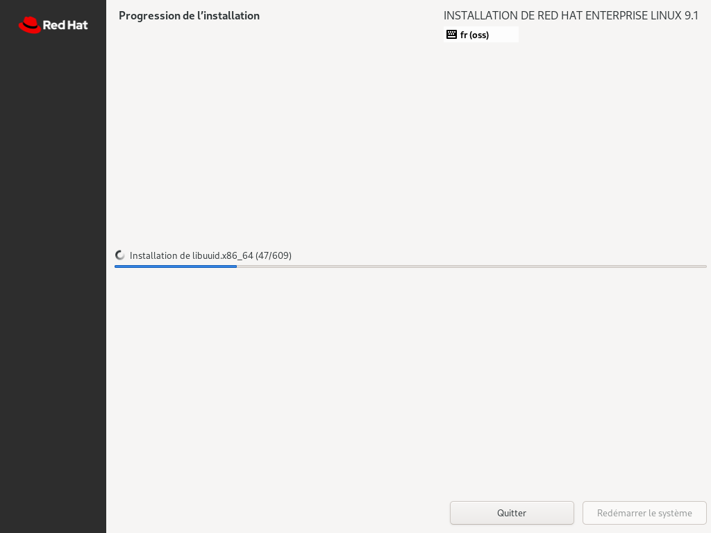

L’installation est maintenant terminée, nous pouvons cliquer sur « Redémarrer le système ».

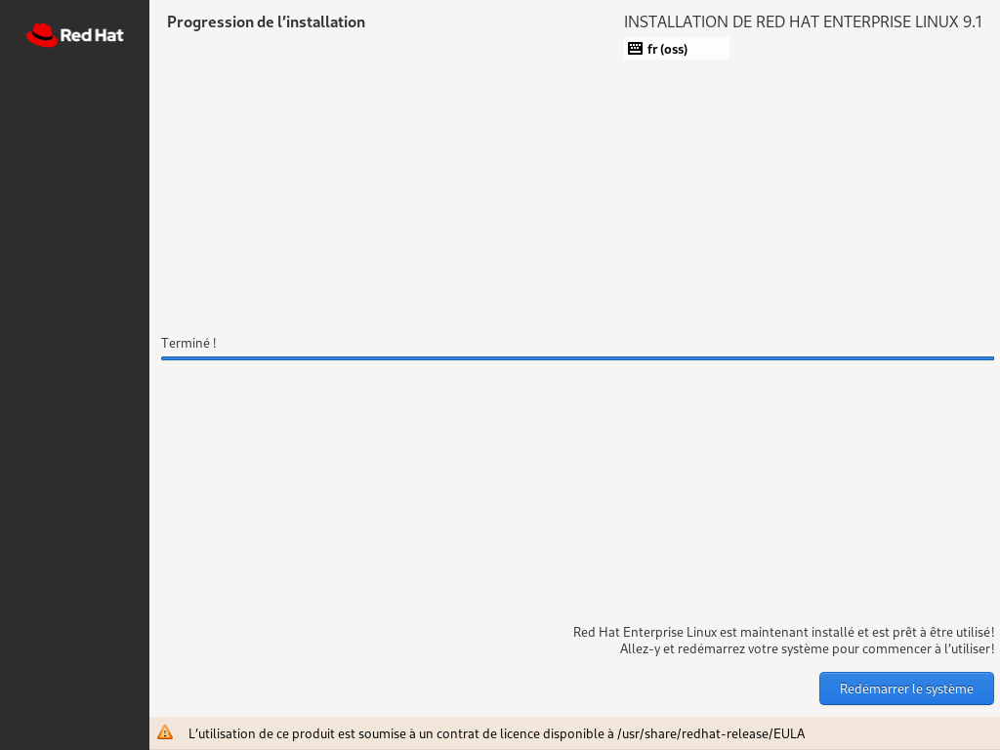

Et à la suite du redémarrage nous arrivons sur l’interface de connexion. Enjoy 😁

