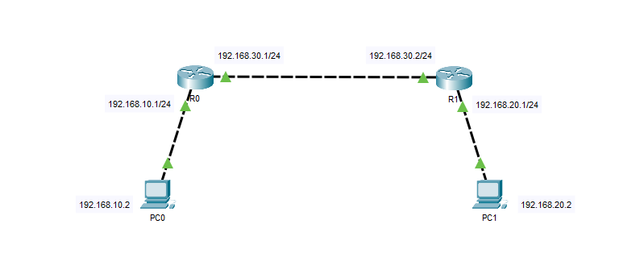
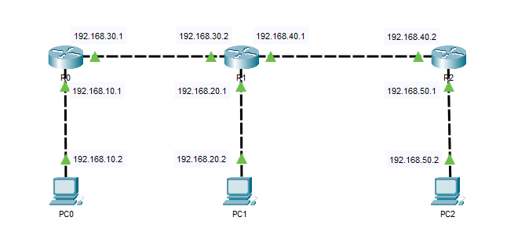

Le routage statique est la première solution pour faire du routage. Cela va permettre d'interconnecter nos réseaux.
Pour pouvoir passer d'un réseau à l'autre, que les routes soient fonctionnelles il faut les déclarer sur chaque routeur !

⚠️ Je vous conseille d'utiliser des routeurs 2911 ⚠️
Pour la première situation ce n'est pas nécessaire, mais si vous souhaitez continuer vous allez aller avoir besoin de plusieurs ports pour interconnecter 3 routeurs. Bien que l'on puisse rajouter des slots, c'est la solution la plus rapide 😉

## 1ère situation: 2 routeurs



Tableau des interfaces de l'architecture – Lecture de gauche à droite par rapport au schéma

| Équipements & Interfaces | Adresse IP & Adresse réseau & Passerelle |
| --- | --- |
| PC0 – Fa0 | 192.168.10.2 – 255.255.255.0 – 192.168.10.1 |
| R0 – Gi0/0 | 192.168.10.1 – 255.255.255.0 |
| R0 – Gi0/1 | 192.168.30.1 – 255.255.255.0 |
| R1 – Gi0/1 | 192.168.30.2 – 255.255.255.0 |
| R1 – Gi0/0 | 192.168.20.1 – 255.255.255.0 |
| PC1 – Fa0 | 192.168.20.2 – 255.255.255.0 – 192.168.20.1 |

### Configuration des interfaces sur R0

```
en
conf t
int gi0/0
ip addr 192.168.10.1 255.255.255.0
no sh
exit

int gi0/1
ip addr 192.168.30.1 255.255.255.0
no sh
```

### Configuration des interfaces sur R1

```
en
conf t
int gi0/1
ip addr 192.168.30.2 255.255.255.0
no sh
exit

int gi0/0
ip addr 192.168.20.1 255.255.255.0
no sh
```

### Configuration des routes statiques

*« Depuis R0, pour atteindre le réseau 192.168.20.0/24 j'envoie le trafic vers la passerelle 192.168.30.2 »*
*« Pour joindre le réseau 192.168.20.0/24, utilise le routeur à l'adresse 192.168.30.2 comme prochain saut ( next-hop ) »*

```
# R0
ip route 192.168.20.0 255.255.255.0 192.168.30.2
```

*« Depuis R1, pour atteindre le réseau 192.168.10.0/24, j'envoie le trafic vers la passerelle 192.168.30.1 »*
*« Pour joindre le réseau 192.168.10.0/24, utilise le routeur à l'adresse 192.168.30.1 comme prochain saut ( next-hop ) »*

```
# R1
ip route 192.168.10.0 255.255.255.0 192.168.30.1
```

## 2ème situation: 3 routeurs



| Équipements & Interfaces | Adresse IP & Adresse réseau & Passerelle |
| --- | --- |
| PC0 – Fa0 | 192.168.10.2 – 255.255.255.0 – 192.168.10.1 |
| R0 – Gi0/0 | 192.168.10.1 – 255.255.255.0 |
| R0 – Gi0/1 | 192.168.30.1 – 255.255.255.0 |
| R1 – Gi0/1 | 192.168.30.2 – 255.255.255.0 |
| R1 – Gi0/0 | 192.168.20.1 – 255.255.255.0 |
| PC1 – Fa0 | 192.168.20.2 – 255.255.255.0 – 192.168.20.1 |
| R1 – Gi0/2 | 192.168.40.1 – 255.255.255.0 |
| R2 – Gi0/1 | 192.168.40.2 – 255.255.255.0 |
| R2 – Gi0/0 | 192.168.50.1 – 255.255.255.0 |

### Configuration des routes statiques

```
# R0
ip route 192.168.20.0 255.255.255.0 192.168.30.2
ip route 192.168.40.0 255.255.255.0 192.168.30.2
ip route 192.168.50.0 255.255.255.0 192.168.30.2
```

```
# R1
ip route 192.168.10.0 255.255.255.0 192.168.30.1
ip route 192.168.50.0 255.255.255.0 192.168.40.2
```

```
# R3
ip route 192.168.30.0 255.255.255.0 192.168.40.1
ip route 192.168.10.0 255.255.255.0 192.168.40.1
ip route 192.168.20.0 255.255.255.0 192.168.40.1
```
