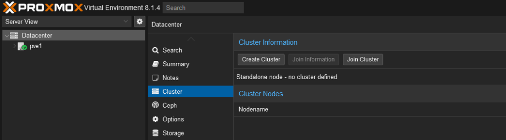
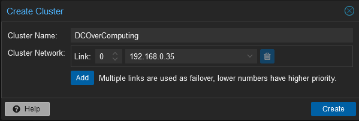
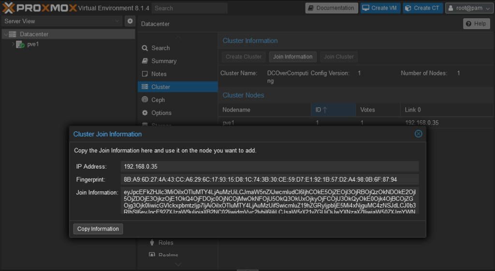
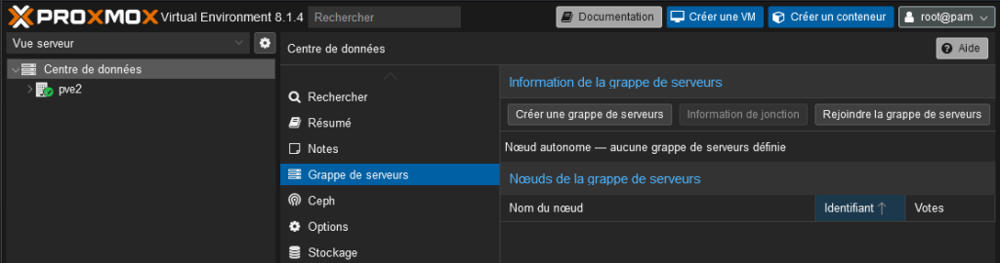
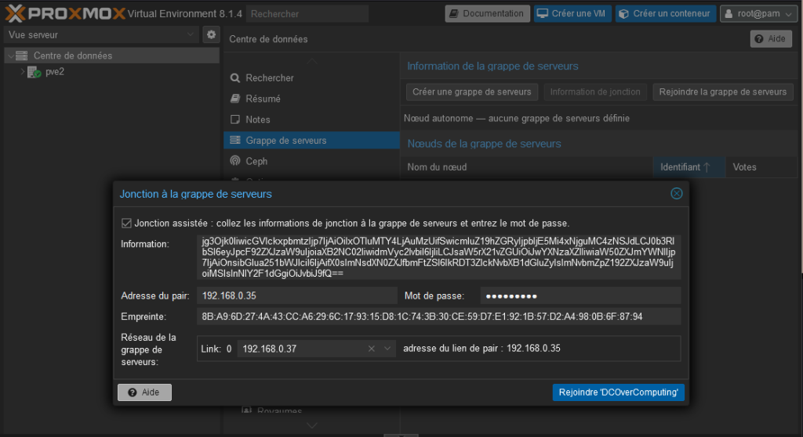

Créer un cluster Proxmox consolide plusieurs serveurs en un seul système pour améliorer la disponibilité et la gestion des ressources. Commencez par configurer un nœud via l’interface web « Datacenter », créez le cluster, ajoutez et authentifiez d’autres nœuds. Une bonne planification et configuration initiale assurent une maintenance simplifiée et une haute disponibilité.

---

Nous voici à l’interface graphique principale de Proxmox. Vous pouvez observer dans la section « Datacenter » le noeud initial, ici nommé ‘pve1’. Pour commencer la formation d’un cluster, vous devez cliquer sur l’option « Cluster » dans le menu de gauche, ce qui ouvre un panneau affichant les informations actuelles du cluster. Puisque nous n’avons pas encore de cluster défini, le panneau indique « Standalone node – no cluster defined ». Pour créer un nouveau cluster, il suffit de cliquer sur le bouton « Create Cluster ». Vous serez ensuite guidé à travers une série de champs à remplir, tels que le nom du cluster et d’autres paramètres réseau nécessaires. Une fois le cluster créé, vous pourrez ajouter d’autres noeuds, permettant ainsi la gestion centralisée de vos machines virtuelles et conteneurs à travers les différents serveurs de votre infrastructure. C’est une étape cruciale pour l’extension de votre environnement virtualisé et pour assurer la haute disponibilité de vos services.

Après avoir cliqué sur « Create Cluster » depuis la page de gestion du Datacenter, nous sommes face à la fenêtre de configuration du cluster. Ici, vous devez entrer le nom souhaité pour votre cluster, « DCOverComputing » dans notre exemple, ce qui permettra d’identifier le cluster au sein de votre réseau. En dessous, dans la section « Cluster Network », vous pouvez spécifier le lien réseau et l’adresse IP utilisée pour la communication du cluster. Dans cet exemple, le lien 0 est sélectionné avec l’adresse IP 192.168.0.35. Si vous avez plusieurs liens réseau, ils peuvent être ajoutés en tant que failover ; les liens avec des numéros plus bas auront une priorité plus élevée. Après avoir configuré ces paramètres, en cliquant sur le bouton « Create », vous initialiserez la formation de votre cluster, marquant ainsi le début d’une infrastructure de serveurs hautement disponible et facilement gérable.

Dans la section « Cluster Join Information », vous avez les détails nécessaires pour connecter de nouveaux nœuds au cluster que vous venez de créer. L’adresse IP du cluster, le fingerprint et les informations de jointure sont clairement indiqués. Pour intégrer un nouveau nœud au cluster, copiez ces informations en cliquant sur « Copy Information », puis appliquez-les sur le nœud que vous souhaitez ajouter via sa propre interface Proxmox. Cette action assure une connexion sécurisée et authentifiée entre les nœuds du cluster, permettant une communication fiable et la réplication des configurations au sein du réseau étendu.

Après avoir créé un cluster sur le premier nœud, vous pouvez ajouter d’autres nœuds, comme ‘pve2’ montré ici. Dans l’interface de ‘pve2’, sélectionnez « Grappe de serveurs » et cliquez sur « Rejoindre la grappe de serveurs » pour commencer le processus d’ajout au cluster existant. Vous devrez entrer les informations de jonction fournies par le nœud principal. Cela élargira votre cluster Proxmox et renforcera votre infrastructure virtualisée.

Pour intégrer ‘pve2’ au cluster, on est sur l’écran « Jonction à la grappe de serveurs » où l’on colle les informations de jonction du nœud principal. On vérifie l’adresse IP et l’empreinte pour sécuriser la connexion, puis on saisit le mot de passe. En cliquant sur « Rejoindre DCOverComputing », ‘pve2’ sera ajouté au cluster, renforçant votre réseau de serveurs virtualisés.

Le cluster « DCOverComputing » est maintenant opérationnel avec deux nœuds, ‘pve1’ et ‘pve2’, comme l’indique l’écran « Cluster » dans Proxmox VE. Les deux nœuds sont prêts pour la gestion et la répartition des ressources virtualisées.

