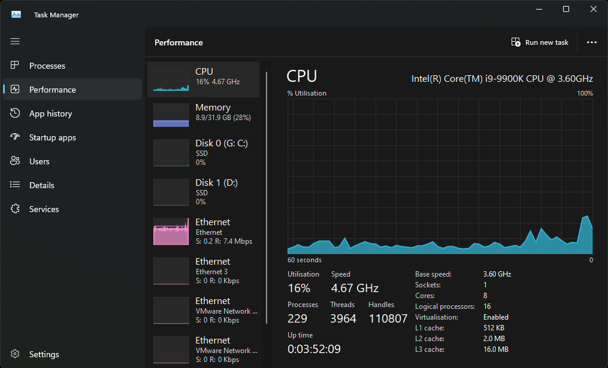
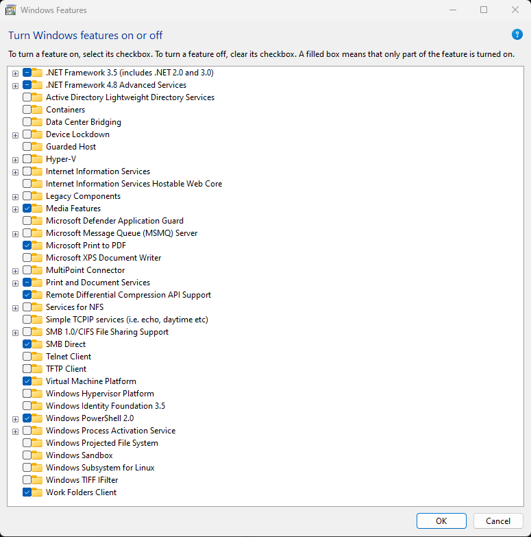
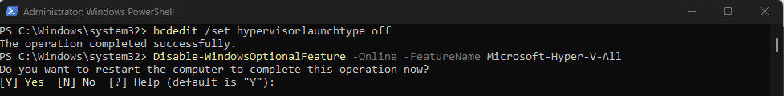

La première chose à faire, c’est de savoir si la virtualisation est bien activé. Pour cela, soit on peut aller voir directement dans le BIOS, soit nous pouvons depuis le gestionnaire de tâche, dans l’onglet performance puis CPU voir si l’option Virtualisation est à « Activer. » Cette option va indiquer si on est bon côté matériel, si c’est activé que le problème ne se trouve pas ici.



Lorsque l’on active l’option « Virtualize Intel VT-x/EPT or AMD-V/RVI » dans les options de VMware Workstation afin de nous permettre de faire de la virtualisation dans notre machine virtuelle, il arrive parfois qu’une erreur survienne. Dans un premier temps c’est un simple message « Virtualized Intel VT-x/EPT is not supported on this platform. Continue without virtualized Intel VT-x/EPT ? », si on appuie sur « No » la machine virtuelle va venir s’arrêter, et si on appuie sur « Yes », un message d’erreur « Module ‘HV’ power on failed » apparait comme ci-dessous.

Ce problème survient lorsque les technologies Hyper-V sont activés sur la machine. Elles ont pu être activés manuellement ou lors de l’installation de WSL. La cohabitation Hyper-V et les autres technologies de virtualisation n’est pas très bonne. Afin de pouvoir résoudre ce problème, il nous faut désactiver dans les fonctionnalités supplémentaires de Windows, Hyper-V ainsi que Windows Hypervisor Platform.

On se rend dans notre barre de recherche Windows, puis on cherche le menu adéquat « Turn Windows feratures on or off »

Dans la nouvelle fenêtre qui s’est ouverte « Windows Features », on s’assure que les deux options « Hyper-V » ainsi que « Virtual Machine Platform » soient bien décochées.



Une fois appuyé sur OK, une nouvelle fenêtre va s’ouvrir qui va nous demander si nous souhaitons redémarrer, on va appuyer sur redémarrer plus tard parce qu’on a encore des opérations à effectuer. On ouvre un powershell en administrateur, puis y rentre ces deux commandes :

```
bcdedit /set hypervisorlaunchtype off
```

```
Disable-WindowsOptionalFeature -Online -FeatureName Microsoft-Hyper-V-All
```

Un prompt nous demande si nous souhaitons redémarrer notre ordinateur afin de pouvoir compléter toutes les opérations maintenant. On appuie sur Y et à la suite de ce redémarrage, l’option « Virtualize Intel VT-x/EPT or AMD-V/RVI » est maintenant utilisable et notre machine virtuelle va démarrer correctement.



Après ce redémarrage, si l’option n’apparait toujours pas, on ouvre un nouveau terminal puis on rentre ces commandes :

```
VBoxManage.exe modifyvm "Proxmox" --nested-hw-virt on
```