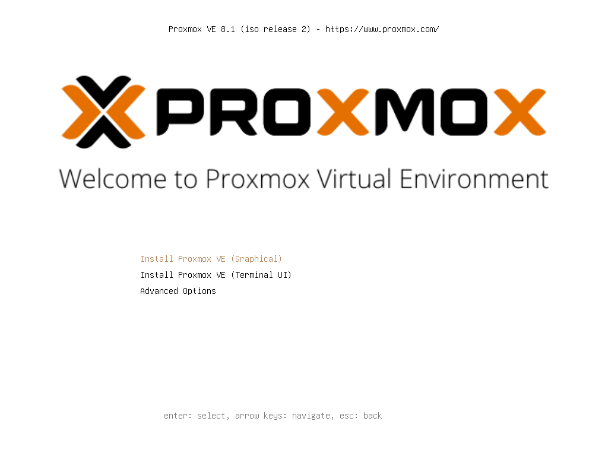
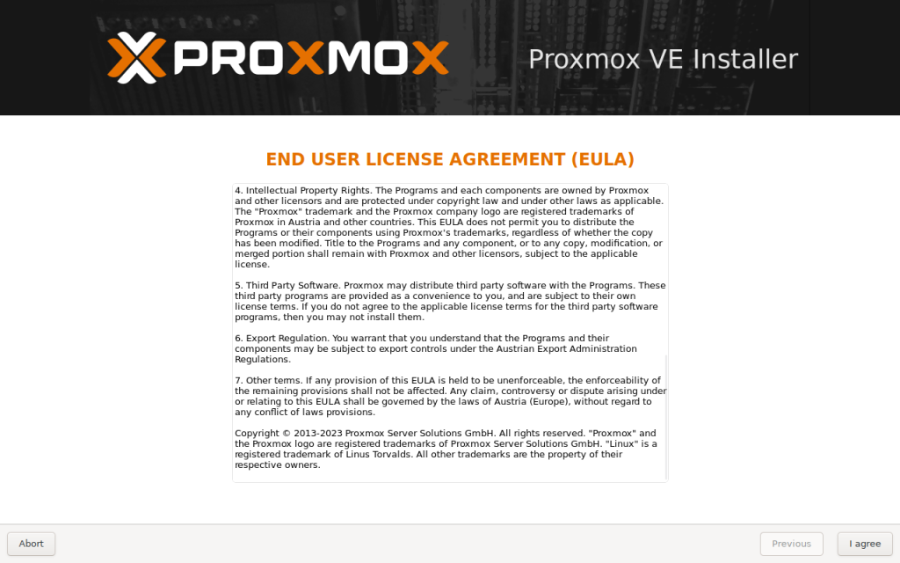
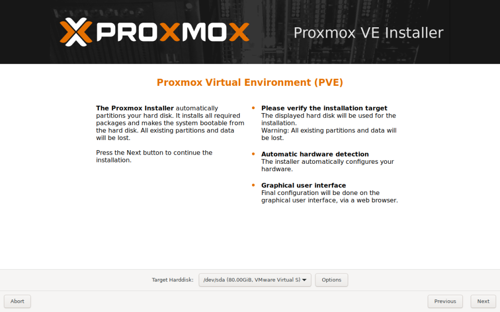
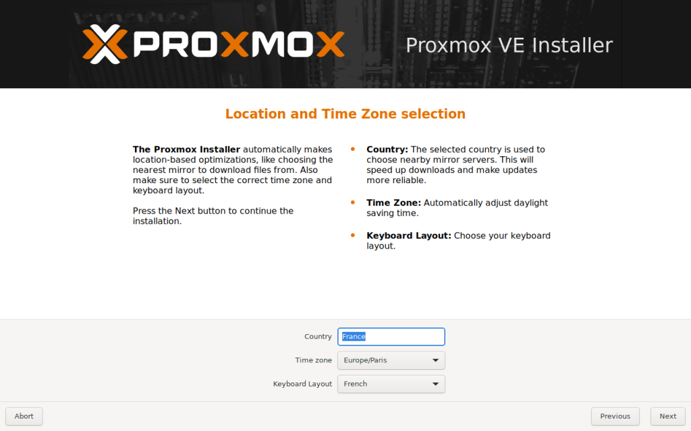
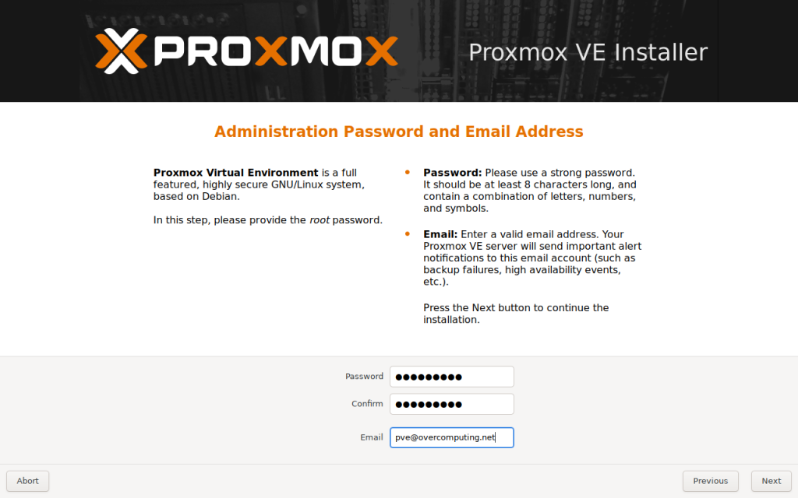
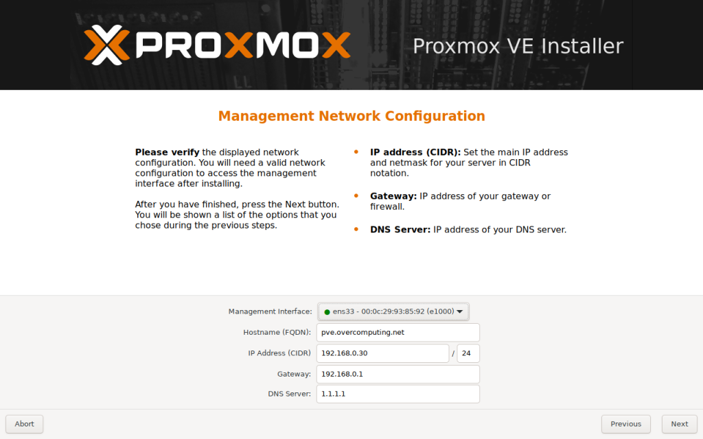
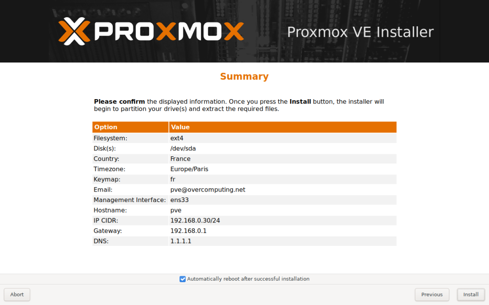

Proxmox VE (Virtual Environment) est une plateforme de gestion de virtualisation open source, intégrant à la fois la virtualisation de machines virtuelles (VM) via KVM (Kernel-based Virtual Machine) et la conteneurisation avec LXC (Linux Containers). Elle offre une solution complète pour la virtualisation de serveurs, avec une interface web conviviale qui facilite la gestion des VMs, des conteneurs, du stockage réseau, et de la haute disponibilité. Proxmox permet aux administrateurs de systèmes de déployer, gérer et surveiller des infrastructures de serveurs virtualisés de manière efficace, en offrant des fonctionnalités avancées telles que la réplication en direct, la migration à chaud des VMs, le backup et la restauration, tout en assurant une sécurité renforcée et une gestion flexible des ressources. Cela en fait une solution populaire pour l’administration de data centers et l’hébergement web, en permettant une gestion centralisée et une réduction des coûts d’infrastructure.

---

À cette étape du tutoriel d’installation de Proxmox VE, vous êtes confronté à l’accord de licence utilisateur final, connu sous l’acronyme EULA (End User License Agreement). Cette page est cruciale car elle détaille les droits de propriété intellectuelle relatifs à Proxmox et à ses composants, indiquant que ceux-ci sont la propriété de Proxmox Server Solutions GmbH et protégés par la législation sur les droits d’auteur. Il y est précisé que les marques « Proxmox » et le logo Proxmox sont des marques déposées par Proxmox Server Solutions GmbH, et que « Linux » est une marque déposée de Linus Torvalds. Vous y trouverez aussi des informations sur l’utilisation de logiciels tiers, les régulations à l’export, et d’autres termes légaux. Il est essentiel de lire attentivement et de comprendre ces termes, car en cliquant sur « I agree », vous acceptez ces conditions et pouvez continuer avec l’installation.

Arrivés à cette étape du tutoriel d’installation de Proxmox Virtual Environment (PVE), nous nous trouvons devant l’interface d’installation qui va préparer notre serveur. La fenêtre affiche un récapitulatif des actions que l’installateur va effectuer : partitionnement automatique du disque dur, installation des paquets nécessaires et configuration du système pour le démarrage. Il est crucial à ce moment de vérifier que le bon disque dur est sélectionné pour l’installation car toutes les partitions et données existantes seront effacées. L’installateur détectera aussi automatiquement le matériel de votre serveur. Notez que la configuration finale se fera via une interface graphique accessible depuis un navigateur web. Assurez-vous que toutes vos données sont sauvegardées avant de procéder, puis cliquez sur le bouton « Next » pour continuer l’installation.

Sur cet écran, l’installateur Proxmox facilite l’optimisation basée sur la localisation, tel que le choix du miroir le plus proche pour le téléchargement des fichiers, ce qui rend les mises à jour plus rapides et fiables. Vous devriez maintenant sélectionner votre pays – dans notre exemple, « France » est déjà sélectionné. Ensuite, assurez-vous que le fuseau horaire « Europe/Paris » est correct et que la disposition du clavier correspond à votre préférence, ici « French ». Ces réglages permettent d’ajuster automatiquement l’heure d’été et d’assurer que votre clavier fonctionnera comme attendu. Une fois ces options vérifiées et ajustées selon vos besoins, cliquez sur le bouton « Next » pour procéder à l’étape suivante de l’installation.

Dans cette étape de notre guide d’installation de Proxmox Virtual Environment, nous allons configurer les informations cruciales pour la sécurité de votre système. Ici, il est demandé de définir le mot de passe administrateur, qui protégera l’accès au compte root, le superutilisateur de votre serveur. Un mot de passe fort est essentiel, il devrait comporter au moins 8 caractères et inclure une combinaison de lettres, de chiffres et de symboles. Après avoir saisi et confirmé votre mot de passe, il vous faut entrer une adresse e-mail valide. Cette adresse sera utilisée par le serveur Proxmox pour vous envoyer des alertes importantes, telles que des notifications d’échec de sauvegarde, des événements liés à la haute disponibilité, etc. Assurez-vous que cette adresse est une adresse où vous pouvez recevoir des notifications administratives. Une fois ces informations saisies, cliquez sur le bouton « Next » pour continuer avec l’installation.

À cette étape de l’installation de Proxmox VE, nous configurons le réseau de gestion. Cette interface nous permet de définir les paramètres réseau essentiels pour que notre serveur Proxmox puisse communiquer correctement sur notre réseau. Vous devez saisir l’adresse IP principale de votre serveur dans la notation CIDR, ainsi que l’adresse de la passerelle, généralement celle de votre routeur ou pare-feu, et enfin, l’adresse du serveur DNS que votre serveur doit utiliser pour résoudre les noms de domaine. Ces informations sont cruciales pour assurer l’accès au serveur après l’installation via l’interface web. Assurez-vous que les données saisies sont correctes. Ici, l’adresse IP est définie comme 192.168.0.30 avec un masque de sous-réseau de 24 bits, la passerelle par défaut est 192.168.0.1, et le serveur DNS utilisé est 1.1.1.1. Après avoir vérifié et confirmé ces paramètres, cliquez sur « Next » pour aller à l’étape suivante de la configuration.

À cette étape finale de notre tutoriel d’installation de Proxmox VE, nous sommes invités à vérifier et confirmer toutes les configurations que nous avons établies. Vous verrez un récapitulatif des choix effectués jusqu’à présent, incluant le système de fichiers (ext4), le disque dur sélectionné (/dev/sda), le pays (France), le fuseau horaire (Europe/Paris), l’agencement du clavier (fr), l’adresse e-mail pour les alertes système (pve@overcomputing.net), l’interface de gestion (ens33), le nom d’hôte (pve), l’adresse IP avec le masque de sous-réseau (192.168.0.30/24), la passerelle (192.168.0.1) et le serveur DNS (1.1.1.1). Avant de cliquer sur le bouton « Install », assurez-vous que toutes ces informations sont correctes. Une fois que vous appuyez sur « Install », l’installation va commencer, partitionner le disque, et installer Proxmox VE. Vous pouvez également choisir de redémarrer automatiquement après une installation réussie en cochant la case correspondante. Assurez-vous de sauvegarder toute donnée importante avant de procéder, car ce processus est irréversible.

