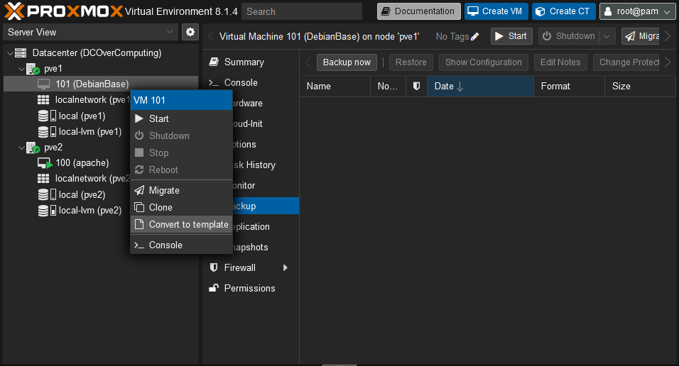
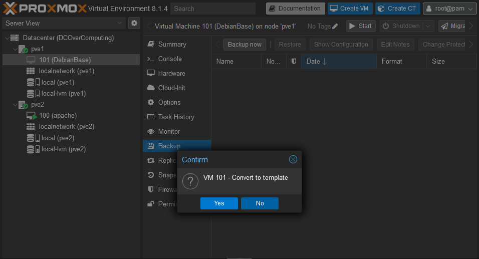
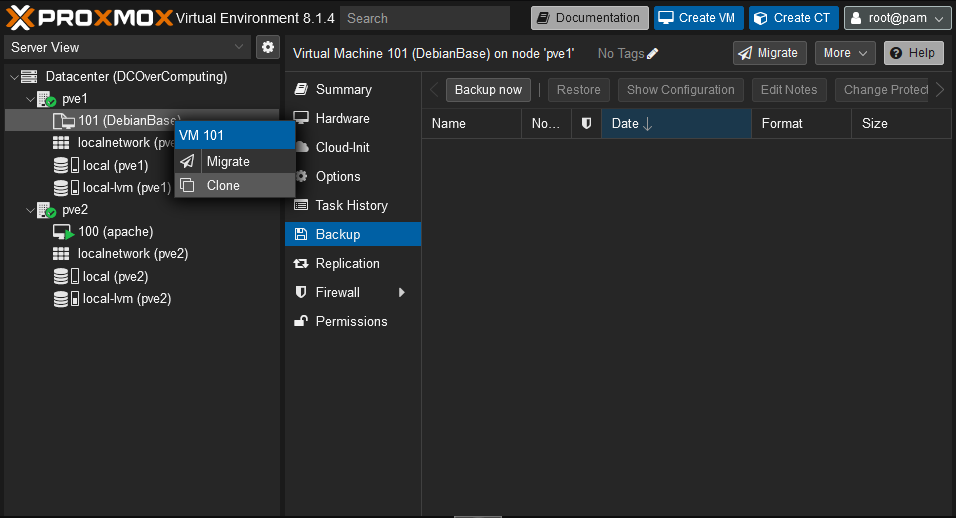
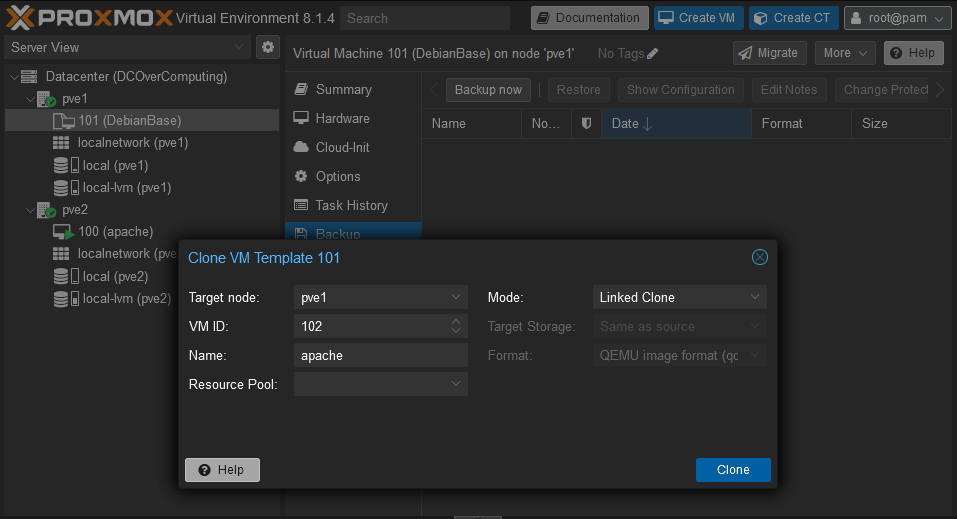

Créer un template de VM sur Proxmox sert à rationaliser et à accélérer le déploiement de nouvelles machines virtuelles (VMs) dans un environnement de virtualisation. Un template agit comme un modèle préconfiguré contenant un système d’exploitation installé, des paramètres système standardisés et des applications prédéfinies. L’utilisation de templates permet aux administrateurs système de dupliquer rapidement une configuration de VM idéale sans avoir à passer par l’ensemble du processus d’installation et de configuration pour chaque nouvelle instance. Cela réduit considérablement le temps et les efforts nécessaires pour mettre en place de nouvelles VMs, en particulier dans les environnements où de nombreuses VMs similaires sont requises, comme les centres de données ou les infrastructures cloud.

